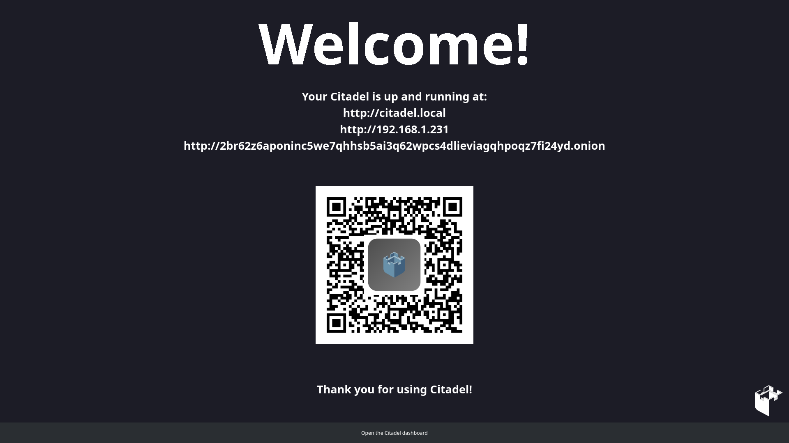

# Citadel boot UI



A new user interface for Citadel when connected to a screen.


## Required packages to build this:

```
sudo apt install libqt5gui5-dev libqt5svg5-dev libqt5network5-dev cmake make gcc g++ qtwebengine5-dev -y
```

## Build

```
mkdir build
cd build
cmake ..
make -j$(nproc)
```

## Running

To run this on an Raspberry Pi with Citadel OS, run
```
./citadel-gui
```
